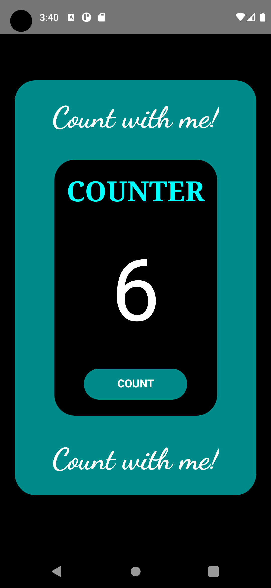
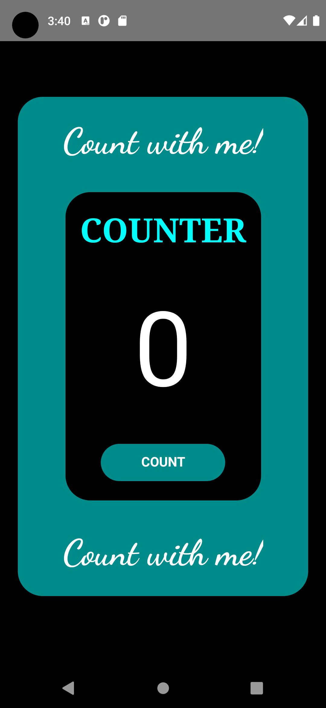
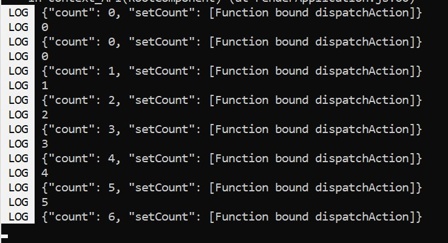

# Assigment - 5 Context API

20BAI1272
JAYASREE M

This is a counter app with a blink animation. It uses context API for the count variable and also the text "Count with me!" displayed.

## App Output Screen :

  

 
<h3>In console </h3>
 

